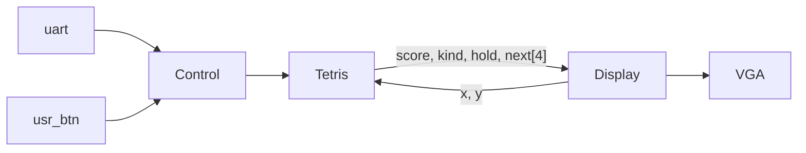
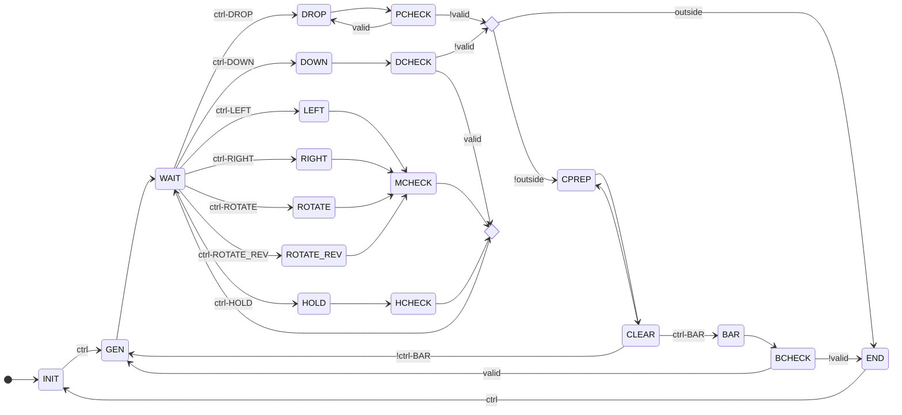

# NYCU DCLab Final - Tetris 俄羅斯方塊

## Score Checkpoint

- 基本功能 60% 16pts
    - [ ] 畫出俄羅斯方塊的背景。 10 x 20
    - [ ] 畫出至少7種不同方塊。  
      1.I 2.J 3.L 4.O 5.S 6.T 7.Z  
      
    - [ ] 會越疊愈高，並且可消除，往下掉。
    - [ ] 方塊可旋轉。
    - [ ] 遊戲畫面有邊界。
    - [ ] 使用button或是switch進行控制遊戲與互動。
- 進階功能 40% 12pts
    - [ ] 設計計分系統。
    - [ ] T轉。
    - [ ] 有Buffer功能可以換方塊。
    - [ ] 隨機生成障礙。
- 額外功能 20% 6pts
    - [ ] 使用者介面 (如: 介面精緻等)
    - [ ] 使用者體驗 (如: 流暢度等)
    - [ ] 添加創新的功能


## CFG



```verilog
// 10 x 20
wire [4:0] x, y;
// x, y -> kind
wire [4*4-1:0] score; // 0xABCD BCD
wire [2:0] kind, hold, next [0:3];
```

### Control

- NONE
- LEFT
  - btn3
  - A
- RIGHT
  - btn0
  - D
- DOWN
  - S
- DROP
  - W
  - space
- HOLD
  - btn1
  - C
- ROTATE
  - btn2
  - X
- ROTATE_REV
  - Z
- BAR

### Tetris



### Display

```mermaid
graph TD;
```
