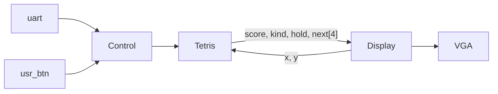
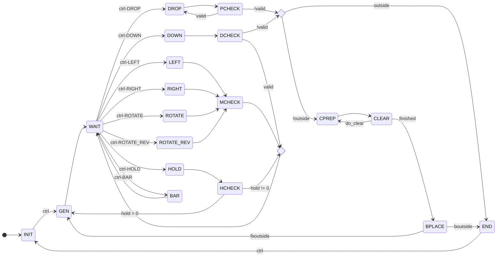

# NYCU DCLab Final - Tetris 俄羅斯方塊

## Score Checkpoint

- 基本功能 60% 16pts
    - [x] 畫出俄羅斯方塊的背景。 10 x 20
    - [x] 畫出至少 7 種不同方塊。  
      1.I 2.J 3.L 4.O 5.S 6.T 7.Z  
      0.none 8.bar 9.preview
         
    - [x] 會越疊愈高，並且可消除，往下掉。
    - [x] 方塊可旋轉。
    - [x] 遊戲畫面有邊界。
    - [x] 使用 button 或是 switch 進行控制遊戲與互動。
- 進階功能 40% 12pts
    - [x] 設計計分系統。
      - [x] 依照消除行數決定分數
      - [x] combo
      - [x] T 轉
    - [x] T 轉。
    - [x] 有 Buffer 功能可以換方塊。
    - [x] 隨機生成障礙。
- 額外功能 20% 6pts
    - [ ] 使用者介面（如：介面精緻等）
      - [x] 開始畫面
      - [x] 結束畫面
      - [x] 倒數計時進度條
      - [ ] ~~bar 預覽~~
      - [ ] combo 次數顯示
      - [ ] T 轉顯示
    - [x] 使用者體驗（如：流暢度等）
      - [x] 掉落方塊位置預覽
      - [ ] 得分增加時間
      - [x] 方塊掉落加速
      - [x] UART 控制
    - [x] 添加創新的功能
      - [x] 倒數計時

### Scoring System
- 消除分數
    - 1行: 1分
    - 2行: 3分
    - 3行: 5分
    - 4行: 8分

分數公式: 消除分數 + combo次數 (如果有T轉則另加4分)


## CFG



```verilog
// 10 x 20
wire [4:0] x, y;
// x, y -> kind
wire [4*4-1:0] score; // 0xABCD BCD
wire [3:0] kind, hold, next [0:3];
```

### Control

- NONE
- LEFT
  - A
  - btn3
  - arrow key left ➜
- RIGHT
  - D
  - btn0
  - arrow key right
- DOWN
  - S
  - btn1
  - arrow key down
- DROP
  - W
  - space
  - sw0
- HOLD
  - C
  - sw1
- ROTATE
  - X
  - btn3
  - arrow key up
- ROTATE_REV
  - Z
  - sw2
- BAR
  - B
  - sw3

### Tetris



### Display

```mermaid
graph TD;
```
